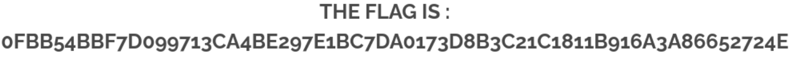

# Vulnerability Report

## Summary

A Stored Cross-Site Scripting (XSS) vulnerability exists in the feedback page's name input field. This flaw allows attackers to inject malicious JavaScript code, which executes when users visit the feedback display page.

## Vulnerability details

### CWE Reference

- **CWE ID**: [CWE-79: Improper Neutralization of Input During Web Page Generation ('Cross-site Scripting')](https://cwe.mitre.org/data/definitions/79.html)

### Description

The application does not properly sanitize input submitted through the name field on the `feedback` page. When users submit feedback, the content of the `name` field is stored in the database and later displayed on the feedback viewing page without appropriate encoding or filtering. This lack of input validation permits attackers to inject malicious scripts. When other users access the feedback viewing page, the injected scripts execute in their browsers, potentially leading to unauthorized actions and data compromise.

### Steps to reproduce

1. Navigate to [feedback](http://darkly/index.php?page=feedback) page.
2. Enter `script` in the `Name` field.
3. Send the form.
3. The flag shows up on the page: 

### Impact
The impact for this vulnerability is high, it allows attackers to execute arbitrary JavaScript code in the browsers of all users visiting the page. It can lead to serious issues such as session hijacking.

## Mitigation
- Input sanitization: using php functions like `htmlspecialchars` in PHP to encode the special characters like `<` to their corresponding html encoded value before storing them in the database should mitigate the problem then those characters will be displayed in the comment as simple text.

## References
- [OWASP Cross-site Scripting (XSS) Prevention Cheat Sheet](https://cheatsheetseries.owasp.org/cheatsheets/Cross_Site_Scripting_Prevention_Cheat_Sheet.html)
