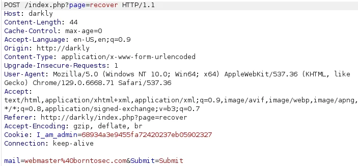

# Weak Password Recovery Mechanism for Forgotten Password

## Description

This vulnerability occurs when an application provides a mechanism for users to recover or reset their password without requiring the original password, but the mechanism is weak or poorly implemented. This can allow attackers to exploit the recovery process to gain unauthorized access to accounts.

## Identify the Vulnerability

When accessing the password recovery page, there is no field to input an email address, suggesting that the application might be designed for a single user. Upon clicking the recovery button, the following request is intercepted:

### Observations:
- The intercepted request shows the client sends an email address, presumably to receive the new password or a recovery link.
- By modifying the email address in the request to an attacker-controlled email, the attacker can receive the password or reset it.

### Additional Notes:
- The domain `borntosec.com` could be added to the `/etc/hosts` file for VHost fuzzing.
- The username `webmaster`, observed during enumeration, could potentially be used for brute-forcing login attempts.
